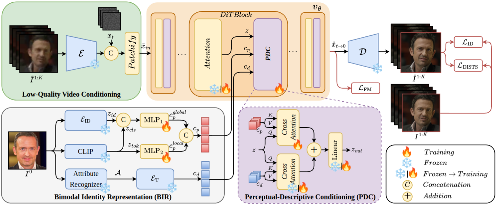
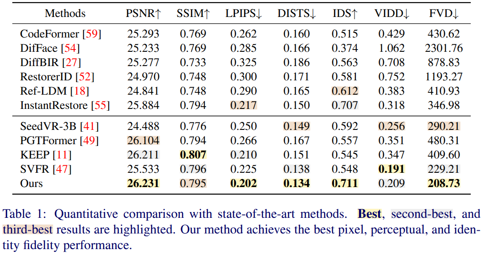

# Subject-Agnostic Identity-Preserving Face Video Restoration with a Reference Guidance
Cem Eteke*, Batuhan Tosun*, Eckehard Steinbach  
Chair of Media Technology, Munich Institute of Robotics and Machine Intelligence  
School of Computation, Information, and Technology, Technical University of Munich, 80333 Munich, Germany

---

## Overview


## Abstract

<details close>
<summary><strong>Show abstract</strong></summary>

<br>

Face video restoration from degraded observations is challenging, as it requires simultaneously recovering visual fidelity, temporal consistency, and subject identity. Existing approaches are often either reference-free, which can lead to identity loss when person-specific facial details are lost, or subject-specific, which limits generalization to unseen identities. We propose a subject-agnostic, reference-guided framework for identity-preserving face video restoration. Our method introduces bimodal perceptual-descriptive identity conditioning into a pretrained flow-based text-to-video generator and employs a two-stage training strategy to strengthen identity guidance during restoration. Experiments show that our approach improves restoration fidelity, temporal consistency, and identity preservation, achieving superior performance under challenging video degradations, including downsampling, blur, noise, and compression artifacts.

</details>

---

## Requirements

- Python 3.10+
- CUDA-capable GPU (tested on CUDA 12.8)

## Installation

```bash
# 1. Create and activate a virtual environment
python -m venv rgfvr_env
source rgfvr_env/bin/activate

# 2. Install PyTorch with the appropriate CUDA build (see https://pytorch.org)
pip install torch torchvision --index-url https://download.pytorch.org/whl/cu128

# 3. Install remaining dependencies
pip install -r requirements.txt
```

## Checkpoints

Place all model weights under a single directory (default: `ckpts/`). Expected layout:

```
ckpts/
├── config.yaml
├── transformer/          # WanRGFVRModel weights (teacher)
├── dmd/
│   └── generator_lora.safetensors  # DMD LoRA weights (3-step distilled)
├── vae/
│   └── Wan2.1_VAE.pth
├── text_encoder/         # WanT5
│   └── models_t5_umt5-xxl-enc-bf16.pth
├── tokenizer/
│   ├── special_tokens_map.json
│   ├── spiece.model
│   ├── tokenizer.json
│   └── tokenizer_config.json
├── face_encoder/         # ArcFace (AntelopeV2) + EVA02-CLIP-L-14-336
│   ├── EVA02_CLIP_L_336_psz14_s6B.pt
│   ├── detection_Resnet50_Final.pth
│   ├── parsing_bisenet.pth
│   ├── parsing_parsenet.pth
│   └── models/
├── facer/                # FaRL attribute predictor
│   └── face_attribute.farl.celeba.pt
└── metadata/
    ├── meta_info.json
    └── appearance_categories.json
```

The `dmd/` subfolder is only required for DMD inference (`inference_dmd.py`).

### [Wan-AI/Wan2.1-T2V-1.3B](https://huggingface.co/Wan-AI/Wan2.1-T2V-1.3B/tree/main)

| File | Destination |
|---|---|
| [`Wan2.1_VAE.pth`](https://huggingface.co/Wan-AI/Wan2.1-T2V-1.3B/blob/main/Wan2.1_VAE.pth) (508 MB) | `ckpts/vae/` |
| [`models_t5_umt5-xxl-enc-bf16.pth`](https://huggingface.co/Wan-AI/Wan2.1-T2V-1.3B/blob/main/models_t5_umt5-xxl-enc-bf16.pth) (11.4 GB) | `ckpts/text_encoder/` |
| All 4 files under [`google/umt5-xxl/`](https://huggingface.co/Wan-AI/Wan2.1-T2V-1.3B/tree/main/google/umt5-xxl) | `ckpts/tokenizer/` |

The `google/umt5-xxl/` directory contains: `special_tokens_map.json`, `spiece.model`, `tokenizer.json`, `tokenizer_config.json`.

### [BestWishYsh/ConsisID-preview](https://huggingface.co/BestWishYsh/ConsisID-preview/tree/main/face_encoder)

Download the following files from [`face_encoder/`](https://huggingface.co/BestWishYsh/ConsisID-preview/tree/main/face_encoder) into `ckpts/face_encoder/`, preserving the `models/` subdirectory structure:

| File | Size | Used for |
|---|---|---|
| `EVA02_CLIP_L_336_psz14_s6B.pt` | 856 MB | EVA02-CLIP visual backbone |
| `detection_Resnet50_Final.pth` | 109 MB | RetinaFace face detector (facexlib) |
| `parsing_bisenet.pth` | 53 MB | Face parsing (facexlib) |
| `parsing_parsenet.pth` | 85 MB | Face parsing (facexlib) |
| `models/` (subdirectory) | — | InsightFace ArcFace embeddings (antelopev2) |

### [FacePerceiver/facer](https://github.com/FacePerceiver/facer/releases/tag/models-v1)

Download [`face_attribute.farl.celeba.pt`](https://github.com/FacePerceiver/facer/releases/download/models-v1/face_attribute.farl.celeba.pt) into `ckpts/facer/`.

### RGFVR model weights *(TODO: upload pending)*

The following weights are specific to RGFVR and will be uploaded to MediaTUM:

- `ckpts/transformer/` — WanRGFVRModel weights
- `ckpts/dmd/generator_lora.safetensors` — DMD LoRA weights (required for `inference_dmd.py` only)

---

## Usage

Two inference modes are available. Both share the same checkpoint directory and produce identical output formats.

### Standard (50-step)

Full-quality 50-step flow matching with classifier-free guidance.

```bash
python inference.py \
    --video_path     path/to/degraded.mp4 \
    --reference_path path/to/reference.jpg \
    --result_path    path/to/output_dir
```

### DMD (3-step, fast)

3-step DMD-distilled inference. Significantly faster with comparable quality. No classifier-free guidance.

```bash
python inference_dmd.py \
    --video_path     path/to/degraded.mp4 \
    --reference_path path/to/reference.jpg \
    --result_path    path/to/output_dir
```

The output video is written to `<result_path>/<clip_name>/<clip_name>.mp4` in both cases.

### All arguments

| Argument | Default | Description |
|---|---|---|
| `--video_path` | `./video.mp4` | Degraded input video (512×512 recommended) |
| `--reference_path` | `./ref.jpg` | High-quality reference image of the target subject |
| `--result_path` | `.` | Output directory |
| `--degree` | `4` | Descriptive prompt detail level (see below) |
| `--prompt` | — | Custom text prompt; overrides `--degree` |
| `--guidance_scale` | `2.0` | CFG scale — **standard only**, ignored by DMD |
| `--fps` | input fps | Output video FPS |
| `--save_frames` | off | Also save each output frame as PNG |
| `--ckpts_dir` | `./ckpts` | Checkpoint directory |

### `--degree`

Controls the level of face-attribute detail included in the descriptive conditioning prompt. Attributes are predicted automatically from the reference image via FaRL.

| Degree | Attributes |
|---|---|
| `0` | Generic prompt (no attribute prediction) |
| `1` | Gender |
| `2` | Gender + hair |
| `3` | Gender + hair + facial hair |
| `4` | All attributes: gender + hair + facial hair + accessories / makeup *(default)* |

Use a lower degree if the reference image is loosely aligned with the subject in the degraded video.

### Examples

```bash
# Standard — full attribute conditioning
python inference.py --video_path video.mp4 --reference_path ref.jpg --result_path out/

# DMD — same interface, ~17× fewer denoising steps
python inference_dmd.py --video_path video.mp4 --reference_path ref.jpg --result_path out/

# More robust when reference is loosely aligned (works for both modes)
python inference.py --video_path video.mp4 --reference_path ref.jpg --result_path out/ --degree 1

# Custom prompt
python inference.py --video_path video.mp4 --reference_path ref.jpg --result_path out/ \
    --prompt "A photorealistic close-up video of a young woman, 4k, high temporal consistency."

# Save individual frames alongside the video
python inference_dmd.py --video_path video.mp4 --reference_path ref.jpg --result_path out/ --save_frames
```

---

## Results



--

## Acknowledgements

This project builds on code and model weights from the following works. We thank the authors for releasing their work openly:

- **[Wan2.1](https://github.com/Wan-Video/Wan2.1)** — base video diffusion model, VAE, and text encoder
- **[VideoX-Fun](https://github.com/aigc-apps/VideoX-Fun)** — training and inference framework
- **[DiffSynth-Studio](https://github.com/modelscope/diffsynth-studio)** — scheduler and diffusion utilities
- **[ConsisID](https://github.com/PKU-YuanGroup/ConsisID)** — face encoder models
- **[EVA-CLIP](https://github.com/baaivision/EVA/tree/master/EVA-CLIP)** — EVA02-CLIP visual backbone
- **[InsightFace](https://github.com/deepinsight/insightface)** — ArcFace identity embeddings
- **[Facer](https://github.com/FacePerceiver/facer)** — FaRL face attribute predictor
- **[CausVid](https://github.com/tianweiy/CausVid)** — DMD distillation approach
